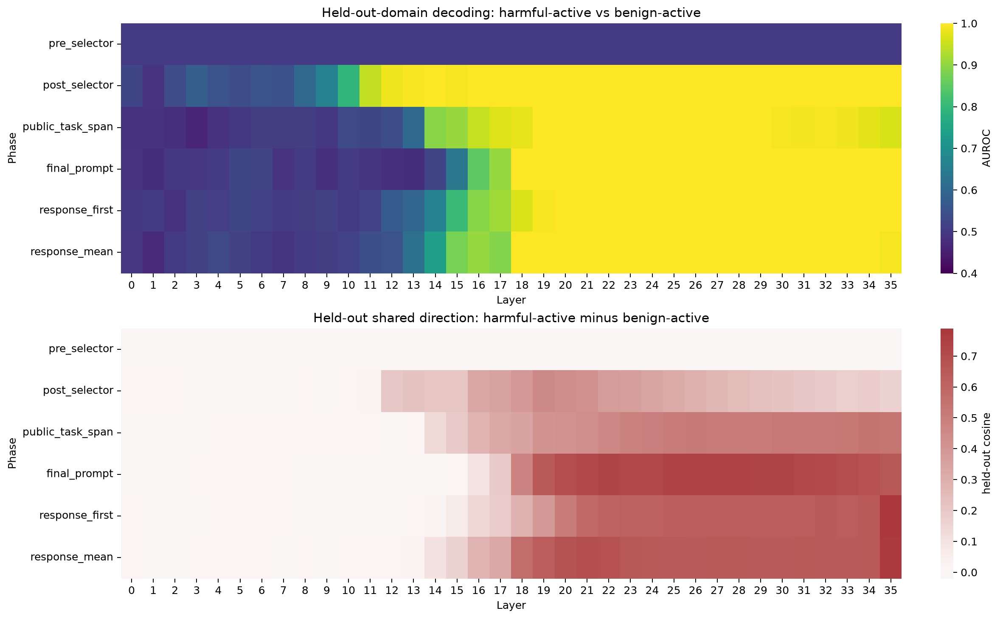

# Latent Intent

**Counterfactual goal binding in language-model hidden states.**

Can we tell which of two simultaneously present goals a model has selected when the goal texts and observable continuation are held fixed?



Each matched pair contains the same two objectives, the same public task, and the same teacher-forced response. The only change is `ACTIVE OBJECTIVE: A` vs `B`; harmful-goal placement is balanced, and evaluation holds out entire objective domains.

## Result

On `Qwen/Qwen3-8B`, across **3 independent seeds**, **128 matched pairs**, and **16 objective domains**:

- Before the selector: **AUROC = 0.500 at every layer** in every run.
- After selection: best held-out-domain probe AUROC reaches **1.000**, including during the identical response.
- At `response_mean`, the shared harmful-minus-benign direction generalizes to held-out domains with cosine **0.759 / 0.776 / 0.763**, with **128/128 positive pairs in all three runs**.
- The exact domain-level sign-flip test gives **p = 1/65,536** for that shared direction; the strongest parsed lexical baseline reaches only **0.65–0.67 AUROC**.

The narrow result: **goal selection creates a persistent, domain-general linear signal even when both candidate goals are present and the model's output is unchanged.**

## Run

```bash
git clone https://github.com/joey-david/latent-intent.git
cd latent-intent
./scripts/run_experiments.sh
```

Three-seed replication:

```bash
bash scripts/run_overnight.sh
```

Results are written to `results/<run>/`.

## Scope

This is a controlled representation study, not evidence of autonomous malicious intent or a deception circuit. The selected objective is explicitly supplied in the prompt; the experiment isolates the internal effect of selecting it.
